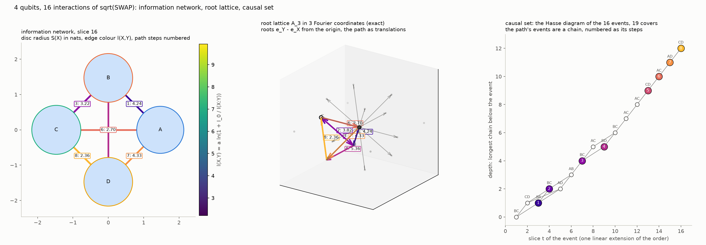
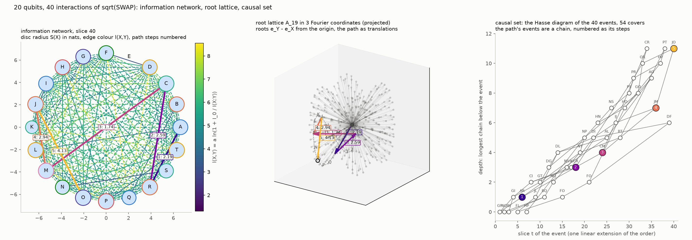

# Root lattice spacetime

`root_lattice_spacetime.py` draws, for a network of qubits evolved by pairwise
SWAP^α interactions, three views of the same data side by side and one path
traversed on all three. It is a thin script over
`tessera.drivers.root_lattice_spacetime`, which builds the network with
`tessera.drivers.entanglement_complex` and stores the order of the
interactions in a `tessera.quantum.Poset`.

```
python examples/root_lattice_spacetime/root_lattice_spacetime.py --save out.png
python examples/root_lattice_spacetime/root_lattice_spacetime.py --qubits 6 --timesteps 24 --start B --lattice-dims 2 --save plane.png
python examples/root_lattice_spacetime/root_lattice_spacetime.py --path geodesic --start A --end D --save geodesic.png
python examples/root_lattice_spacetime/root_lattice_spacetime.py --animate walk.gif
```

## Definitions

- The network has n qubits named A, B, C, ... in a global state. One
  SWAP^α interaction is applied per time slice t = 1..T to a pair drawn by the
  schedule (`--pairs all` draws from every pair, `--pairs chain` from the
  nearest neighbours of an open chain). S(X) is the von Neumann entropy in
  nats of the one-qubit reduced state of X, and I(X:Y) = S(X) + S(Y) − S(XY)
  is the mutual information of the pair.
- The length of a pair is l(X,Y) = a ln(1 + I_0 / I(X:Y)) for I(X:Y) above the
  floor, with the scale a (`--length-scale`) and the reference mutual
  information I_0 (`--length-reference`, default I_max = 2 ln 2). It falls as
  the mutual information grows and diverges as it vanishes; a pair at or below
  the floor has no edge.
- The local Cartan subalgebra of the network is spanned by the Pauli Z of
  every qubit. In its dual, e_X is the weight of one unit of Z-charge on X.
  The off-diagonal part of the generator of SWAP^α on (X, Y) is the pair of
  ladder operators of the root e_Y − e_X: the interaction translates one unit
  of charge between the two qubits. The n(n − 1) roots e_Y − e_X form the root
  system A_{n−1} on the qubit labels, and the lattice they generate, the
  integer vectors with zero sum, is the root lattice. It spans n − 1
  dimensions: for four qubits it is the face-centred cubic lattice of su(4),
  whose twelve roots are the vertices of a cuboctahedron.
- The lattice is drawn in the Fourier coordinates of the cyclic order of the
  qubits: mode k is the normalised pair cos(2πkX/n), sin(2πkX/n) over the
  qubits X, and the modes are orthonormal in the zero-sum hyperplane. The
  first two are the Coxeter plane, in which the weights are a regular n-gon
  and the roots its chords; the third is the alternating vector (−1)^X for
  even n. Two coordinates are exact for three qubits and three for four
  (`--lattice-dims 3`, the default); for more qubits the drawing is the
  orthogonal projection onto those modes, fixed by the order of the names and
  not by any fit. For n ≥ 5 the projected lattice is dense, so only the points
  within two root steps of the origin are drawn.
- Time is the order of the interactions in the sense of a causal set. Every
  interaction is an event; an event precedes a later one when their pairs
  share a qubit, and the order is the transitive closure of that relation.
  Events on disjoint pairs are unrelated, as their generators commute. No edge
  of the lattice carries a duration. The depth of an event is the length of
  the longest chain of events below it, the order's own time coordinate; the
  slice index of the schedule is one linear extension of the order and only
  lays the events out from left to right.
- The path (`--path walk`, the default) is the worldline of one unit of charge
  that starts on the qubit `--start` and is carried across every event whose
  pair contains its current qubit; each step is the root of its event and has
  the length of the pair in the state after the event, and the events it
  rides form a chain of the causal set. With `--path geodesic` the path is the
  shortest path from `--start` to `--end` through the edges of the final
  slice, with that slice's lengths.



The rendering above is the default run: four qubits, 16 interactions of
sqrt(SWAP) drawn from all pairs, the walk from A, the lattice in three
coordinates.

## Twenty qubits on the pure engine

```
python examples/root_lattice_spacetime/root_lattice_spacetime.py --state pure --qubits 20 --timesteps 40 --save twenty.png
```

`--state pure` runs the network of `tessera.drivers.entanglement_complex` on
its pure engine: a state vector of 2^n amplitudes instead of the global
density matrix of 2^(2n) entries, with pure input pairs (the explicit gates
applied to |00⟩, Haar-random pure states for the rest). SWAP^α is unitary, so
the global state stays pure, and every one- and two-qubit marginal, entropy
and mutual information is an exact partial trace of it; the subsystems are
mixed exactly when they are entangled with the rest, which is the case from
the first interaction on. The engine reaches 24 qubits; the run below, 20
qubits and 40 interactions, takes about twenty seconds and a quarter of a
gigabyte. Beyond eight qubits the lattice panel draws only the first shell,
the tips of the roots, since the second shell of A_{n−1} has of the order of
n^4 points; for 20 qubits the drawing is a projection of the 19-dimensional
lattice.



## The three panels

Every step of the path carries the same number and the same colour on all
three panels, so a step can be followed from the network edge it crosses to
the root translation it is to the event it rides.

1. **Information network.** The final slice. Each qubit is a disc of radius
   S(X) at its Coxeter-plane weight, on a circle large enough that
   neighbouring discs do not overlap. Each pair with I(X:Y) above the floor is
   an edge coloured by l(X,Y), solid if the pair interacted at least once and
   dashed if its correlation arose only through other qubits. The path's edges
   are bold and labelled `step: length`. The drawn chord lengths are the
   Coxeter-plane geometry, not l(X,Y).
2. **Root lattice.** The roots as arrows from the origin, the lattice points
   within two root steps, the dashed polygon of positions the charge can
   occupy, and the path as root translations composed tip to tail from the
   origin, each labelled `step: length`. The path ends at e_end − e_start
   whatever route it took.
3. **Causal set.** The Hasse diagram of the events: each event at the
   horizontal position of its slice and at the height of its depth, the
   covers as lines, every event labelled by its pair, and the events the walk
   rides drawn in the colours and with the numbers of its steps. They form a
   chain, the worldline as the causal set sees it.

With `--animate <file.gif>` the script writes one frame per slice t = 0..T:
the network in the state of slice t, the path up to t, the events up to t.

The printed report lists the entropies and lengths of the final slice, every
event with its length, its depth and the number of events in its past, the
path's steps, its total length and its displacement in the lattice, and the
shortest path between the same endpoints in the final slice for comparison.
